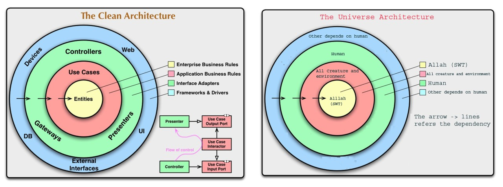

# PetProject

## Description

This is my PetProject - A pratical Project

Tech stack: .NET 7 with Clean Architecture and CQRS, Modular Monolith, Domain-Driven Design, SOLID, Asp.Net Core, EF Core, Identity Custom Storage, Dapper, Mediator, RabbitMQ, Redis as Distributed memory

## Clean Architecture

## CQRS

## Todo

Update usage of Redis, MessageBroker and ElasticSearch (Not completed at all)

Add AzureAD B2C for API, practice some more with Azure like FunctionApp, BlobStorage, EventGrid and setup to connect to a VNet...

## References

 - [ Pratical - Clean Architecture ](https://github.com/phongnguyend/Practical.CleanArchitecture)
 - [ Sample .NET with CQRS ](https://github.com/kgrzybek/sample-dotnet-core-cqrs-api)
